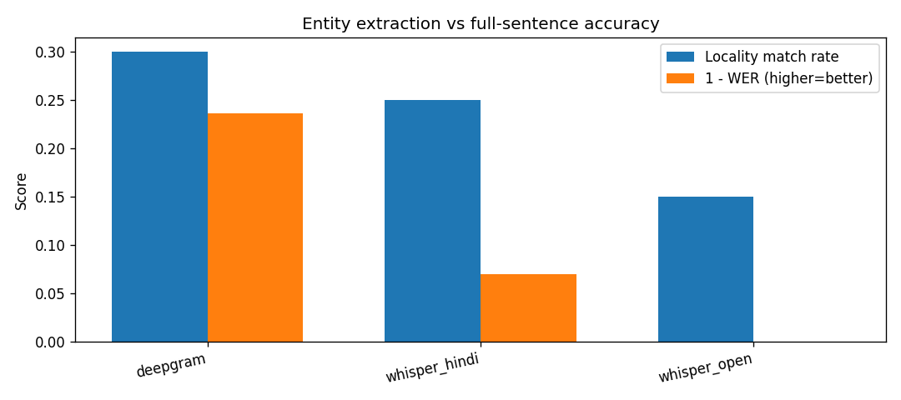
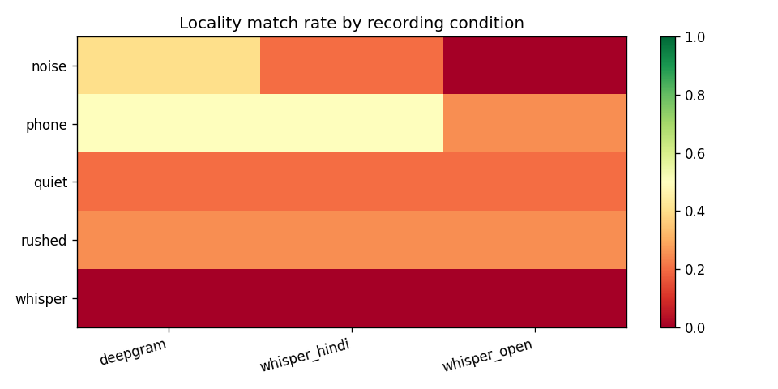

# ASR Shootout: Bangalore Locality Extraction

**Balajisrinath R**  
Deepgram baseline: nova-2, `en-IN`

---

## Executive summary

I recorded 20 short phone-style clips where I say Bangalore locality names in natural Tanglish/English (not studio readings). I ran them through three speech-to-text setups and scored how often each one actually caught the **area name** — because that’s what matters if a candidate tells you where they live on a call.

**Deepgram did best overall:** about **30%** of clips got the locality right, with **76%** word error rate on the full sentence. The open-source Whisper runs were worse on place names, even though they were a bit faster.

**What surprised me:** forcing Hindi on Whisper (`language=hi`) got **25%** locality match — pretty close to Deepgram — while auto-detect Whisper only hit **15%**, even though it’s the same tiny model. So picking the “wrong” language setting changes locality more than I expected. WER alone would mislead you here.

**What I’d actually do:** use **Deepgram** for live calls and WhatsApp voice notes if getting the locality into the system is the goal. I wouldn’t swap in self-hosted Whisper without testing on real hiring audio first, and I wouldn’t force Hindi on Tamil–English speakers without checking. On the product side, I’d add simple guardrails: ask them to repeat the area name, flag low-confidence slots, and don’t silently accept empty transcripts — several of my whisper-quiet clips came back blank for everyone.

**About the data:** I recorded everything in one sitting on my phone before I travelled. I didn’t re-shoot the weak clips. I left them in on purpose — that’s what happens in the real world too.

---

## Why I picked these three systems

| System | What it is | Why I included it |
|--------|------------|-------------------|
| **Deepgram** | Paid API | Required baseline. Closest to “ship it and don’t run your own GPU farm.” |
| **whisper_open** | Free Whisper, auto language | No per-minute bill. Handles Tamil–English mix without me picking a language. |
| **whisper_hindi** | Same Whisper, Hindi forced | Lots of hiring traffic in India is Hindi-first — I wanted to see what breaks on my Tanglish clips. |

For Whisper I used the **tiny** model, downloaded once into `models/whisper-tiny/` (see README — Windows cache was flaky otherwise).

---

## Results

| Model | WER | Got locality right? | Latency (avg) | vs Deepgram (locality) |
|-------|-----|---------------------|---------------|-------------------------|
| deepgram | 76.4% | **30.0%** | 1.9 s | — |
| whisper_hindi | 93.0% | 25.0% | 1.1 s | −5 pts |
| whisper_open | 111.5%* | 15.0% | 1.2 s | −15 pts |

\*WER above 100% happens when the model adds extra words vs my short reference line — jiwer counts that harshly.

### Deepgram by recording type

| How I recorded | Locality match |
|----------------|----------------|
| Phone / speaker | **50%** |
| With background noise | 40% |
| Rushed | 25% |
| Quiet room | 20% |
| Whisper voice | 0% |

The phone clips did *better* than the quiet ones, which is the opposite of what I assumed going in.





### Who beat Deepgram on locality?

On this set, **nobody**. Whisper-auto lost head-to-head on 3 clips; Hindi-forced lost on 1.

---

## Where things broke (real examples)

| Clip | Place | What Deepgram heard | What went wrong |
|------|-------|---------------------|-----------------|
| Indiranagar (noise) | Indiranagar | “…near **Granada**” | Classic noise + English name confusion |
| Whitefield (phone) | Whitefield | “white fill pocket” | Code-switch; sounds nothing like Whitefield |
| Marathahalli (quiet) | Marathahalli | *(nothing)* | Too quiet — model returned empty |
| Jayanagar (noise) | Jayanagar | Got Jayanagar ✓ | Whisper said “giant auger” instead |
| BTM (whisper) | BTM Layout | *(nothing)* | I spoke too soft; fair failure |

**Takeaways:** noise messes up English locality names; Tanglish trips up OSS more than the API; sometimes the audio is just too quiet and no model saves you.

---

## Other things I looked at

- **Speed:** Whisper was roughly 1.1 s per file on CPU vs ~1.9 s for Deepgram (batch, not streaming).
- **Cost:** Deepgram is roughly **$43 per 10,000 minutes** on pay-as-you-go (rough estimate). Whisper costs compute, not per minute.
- **Streaming:** I didn’t test live streaming latency — only batch files.
- **Running OSS:** you need the ~75 MB model folder plus a decent CPU or GPU.

---

## Limitations (being straight about it)

- Just me talking — one Tanglish/English speaker, not a Bangalore local.
- One recording day; no retakes because I was travelling.
- Noise and “phone call” were simulated, not a real telecom line.
- Only 20 clips — good for direction, not for production SLAs.
- Bigger Whisper models might rank differently; I used **tiny** to keep it runnable on a laptop.

---

## How to rerun

```powershell
pip install -r requirements.txt
copy .env.example .env
# add your DEEPGRAM_API_KEY
python scripts/download_whisper.py
python run_benchmark.py
```
